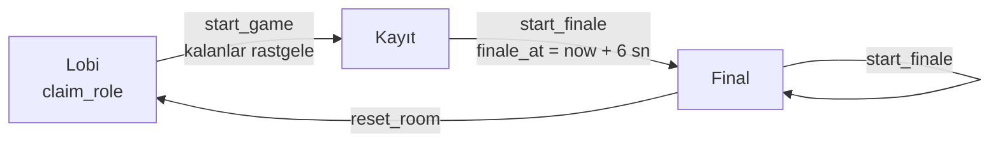

<div align="center">

# 🎙️ fam-io

### Sahneyi seç, rolünü al, sesini ver.

Arkadaşlarınla film, dizi ve çizgi film sahnelerini seslendirdiğin **çok oyunculu dublaj oyunu**.<br/>
Herkes karakterini seçer, repliklerini kaydeder, final **herkesin ekranında aynı anda** başlar ve dublajlı video indirilir.


**Ücretsiz · Filigransız · Profil, seri ve level sistemiyle**

</div>

---

<!--
Ekran görüntüleri: docs/ klasörüne koyup aşağıdaki satırların yorumunu kaldır.
<p align="center">
  
  
  
</p>
-->

## ✨ Özellikler

| | |
|---|---|
| 🎲 **Oyun modları** | **Klasik**, **Kulaktan kulağa** (orijinali sadece ilk kişi duyar, herkes bir öncekini taklit eder), **Senarist** (önce replikleri yeniden yaz, sonra seslendir) ve **Düello** (aynı replikte eleme usulü turnuva). |
| 🃏 **Ekler** | **Zorluk kartları** (fısıldayarak, spiker gibi, ağlayarak…), **Hain** (gizli görevli oyuncuyu bul) ve **Foley ustası** (biri konuşmaz, sahnenin efektlerini yapar). |
| 👤 **Profiller** | Kullanıcı adı + şifre ile profil, profil fotoğrafı, kapak görseli, 5 saniyelik imza sesi ve ziyaretçi defteri. Dublajların, level'in, serin ve en uyumlu partnerlerin profilinde. |
| 🛍️ **XP mağazası** | Kazandığın XP ile çerçeve, isim efekti, plaket, giriş sesi ve profil kapağı al. Harcamak level'i düşürmez. |
| 🛡️ **Ekipler** | Arkadaş grubunla ekip kur, davet koduyla topla; haftalık ekip ligi. |
| 🤖 **Discord komutları** | `/dublaj` ile Discord'dan oda kur, `/liderlik`, `/ekipler`, `/profil`. |
| 🎬 **Yapımcılar** | Sahne ekleyenler her yerde "Oluşturan: …" etiketiyle görünür; sahneleri oynandıkça yapımcı XP'si ve rozet kazanırlar. |
| 🥇 **Haftalık liderlik** | Her pazartesi sıfırlanan XP sıralaması, geçen haftanın kazananı, tüm zamanlar ve yapımcılar tablosu. Haftayı birinci bitiren "Haftanın Sesi" rozetini alır. |
| 🔎 **Kütüphane** | Arama, etiketler (#anime, #komedi…), karakter sayısına göre filtre ve "Trend" sıralaması. Her sahnenin kapak görseli var. |
| 🔥 **Günlük seri** | Her gün bir sahne tamamla, seri büyüsün. Günün ilk sahnesi bonus XP verir. |
| 🏆 **Level ve XP** | Sahne tamamla, replik seslendir, beğeni topla; level atla. |
| 💞 **Uyum** | Birlikte yaptığınız sahnelere ve aldıkları beğenilere göre arkadaşlarınla uyum yüzden. |
| 💬 **Beğeni ve yorum** | Dublajlara beğeni ve yorum bırak, canlı güncellenir. |
| 🔗 **Paylaşım linki** | Her dublajın herkese açık bir sayfası var; hesabı olmayan da izleyebilir. Discord/WhatsApp'ta sahne karesi ve seslendirenlerle zengin önizleme kartı çıkar. |
| 🎛️ **Ses efektleri** | Robot, Sincap, Kalın ses, Dev, Telefon, Megafon, Mağara, Uzaylı. Kayıttan sonra da değiştirilebilir; senkron bozulmaz. |
| 🗳️ **Final oylaması** | "Turun seslendirmeni" ve "En komik replik". Her oy +10 XP. |
| 🏅 **Rozetler** | 30'a yakın otomatik rozet ve Kurucu, Erken Üye gibi özel rozetler; en iyileri isminin yanında. Rozet kazanınca, level atlayınca kutlama animasyonu. |
| 🛡️ **Oda yönetimi** | Oda sahibi oyuncu çıkarabilir, odayı kilitleyebilir, sahipliği devredebilir. |
| 🧭 **İlk giriş rehberi** | 3 adımlık kısa tur ve kimseyi beklemeden "tek başına prova". |
| 🧰 **Yönetim paneli** | Kurucu rozeti olanlara: rozet verme, Discord ayarı, sahne/dublaj/yorum silme, depolama temizliği. |
| 🗜️ **Otomatik sıkıştırma** | Yüklenen videolar tarayıcıda 720p'ye küçültülür; ücretsiz depolama çok daha geç dolar. |
| 💬 **Discord bildirimi** | Her yeni dublaj Discord kanalınıza otomatik düşer. |
| 🎭 **Karakter seçimi** | Herkes lobide istediği karakteri seçer; seçilmeyenler başlarken rastgele dağıtılır. |
| 🎧 **Orijinali dinle** | Kayıttan önce repliğin orijinal sesini dinle, benzer bir replik uydur. |
| 🎬 **Replik bazlı kayıt** | 3-2-1 geri sayım, altyazı ve ilerleme çubuğu. Geri sayım sırasındaki sesler finale girmez. |
| ↻ **Sınırsız tekrar çekim** | Kaydını dinle, beğenmezsen tekrar çek. Kendi sesinle tüm sahneyi önizle. Kayıt sırasında canlı ses dalgası; ses gelmezse uyarı. |
| 🍿 **Senkron final** | Final, sunucu saatine göre herkesin ekranında aynı saniyede başlar; sonunda jenerik gelir. |
| ⬇️ **Videoyu indir** | Dublajlı video tamamen tarayıcıda üretilir (MP4/WebM). Sunucu yok, ücret yok, filigran yok. |
| 🤫 **Gizli kayıtlar** | Diğer oyuncuların kayıtları veritabanı seviyesinde (RLS) final başlayana kadar görünmez. |
| ✂️ **Sahne editörü** | Klibini yükle, 1–7 karakter ekle, karakter konuşurken **K**'ya basılı tutarak replikleri işaretle. |
| 🧊 **3D dublaj makinesi** | Ana sayfada döndürülebilir, tıklanabilir 3D sahne (Lobi → Kayıt → Miks → Prömiyer → İndir). |
| 🔒 **Arkadaş kapısı** | İsteğe bağlı site şifresiyle sadece tanıdıklara açık. |

## 🕹️ Nasıl oynanır?

```
 1. Oda kur        →  Kütüphaneden sahne seç, 5 haneli kodu arkadaşlarına at
 2. Karakter seç    →  Lobide herkes istediği karakteri alır
 3. Kaydet          →  Orijinali dinle (O), kaydet (R), beğenmezsen tekrar çek, "Hazırım" de
 4. Final           →  Oda sahibi başlatır, herkes aynı anda ilk kez izler
 5. İndir           →  Dublajlı videoyu MP4 olarak kaydet
```

## 🧠 Nasıl çalışıyor?



**Kayıt hizalama ve kırpma.** Her kayıt, MediaRecorder'ın başladığı andaki `video.currentTime` ile birlikte saklanır; böylece cihaz gecikmesi ne olursa olsun ses videoda doğru yere oturur. Oynatırken her kayıt sadece kendi replik aralığında çalınır, geri sayım sırasındaki sesler kırpılır.

**Tarayıcıda video üretimi.** Video kareleri bir canvas'a çizilir, sesler Web Audio ile miks edilir, `MediaRecorder` ikisini tek dosyaya yazar. H.264 destekleyen tarayıcılarda MP4, diğerlerinde WebM üretilir.

**Senkron final.** İstemci, `server_now()` RPC'siyle sunucu saatiyle arasındaki farkı ölçer ve `finale_at` anına göre geri sayar. Tüm ses kayıtları Web Audio API ile örnek hassasiyetinde planlanır. Video ses saatini takip eder; kayma olursa oynatma hızını ince ayarlayarak ya da atlayarak düzeltir. Bluetooth kulaklık gecikmesi de hesaba katılır.

**Sıfır render maliyeti.** Final sunucuda video olarak üretilmez, tarayıcıda canlı birleştirilir. Bu sayede proje Supabase ve Vercel'in ücretsiz katmanlarında rahatça çalışır.

**Güvenlik.** Rol dağıtma, kayıt kaydetme ve finali başlatma gibi yazma işlemleri yalnızca yetki kontrolü yapan `security definer` Postgres fonksiyonlarıyla yapılır. Kayıtlar Row Level Security ile korunur.

## 🛠️ Teknolojiler

- **Frontend:** Next.js 16 (App Router), React 19, TypeScript, Tailwind CSS 4
- **Backend:** Supabase (Postgres + RLS, Realtime, Storage, Auth)
- **Medya:** MediaRecorder API, Web Audio API (efektler dahil), WebCodecs + Mediabunny (sıkıştırma), Canvas captureStream
- **3D:** three.js (prosedürel, model dosyası yok)
- **Dağıtım:** Vercel

## 🚀 Kurulum

### 1. Supabase

1. [supabase.com](https://supabase.com) üzerinde yeni bir proje oluştur (ücretsiz plan yeterli).
2. **SQL Editor**'a `supabase/schema.sql` dosyasının tamamını yapıştır ve **Run**'a bas.
3. **Authentication → Sign In / Providers → Email** altında **"Confirm email" seçeneğini kapat.** (Kullanıcı adı + şifre ile giriş için gerekli; hiç e-posta gönderilmez.) "Allow new users to sign up" açık kalmalı.
4. **Project Settings → API** sayfasından `Project URL` ve `anon public` anahtarını kopyala.

### 2. Yerel geliştirme

```bash
git clone https://github.com/<kullanici-adi>/fam-io.git
cd fam-io
cp .env.example .env.local   # Supabase bilgilerini doldur
npm install
npm run dev
```

→ http://localhost:3000

### 3. Ortam değişkenleri

| Değişken | Açıklama |
|---|---|
| `NEXT_PUBLIC_SUPABASE_URL` | Supabase proje URL'si |
| `NEXT_PUBLIC_SUPABASE_ANON_KEY` | Supabase anon (public) anahtarı |
| `SITE_PASSWORD` | *(opsiyonel)* Tanımlanırsa site sadece şifreyi bilenlere açılır (paylaşım linkleri hariç) |
| `NEXT_PUBLIC_AUTH_EMAIL_DOMAIN` | *(opsiyonel)* Kullanıcı adından üretilen gizli e-posta adreslerinin alan adı |
| `NEXT_PUBLIC_SITE_URL` | *(opsiyonel)* Sitenin tam adresi (paylaşım görselleri için). Vercel'de boş bırakılabilir, otomatik bulunur. |
| `DISCORD_PUBLIC_KEY` | *(opsiyonel)* Discord komutları için uygulamanın Public Key'i |
| `SUPABASE_SERVICE_ROLE_KEY` | *(opsiyonel)* Discord komutları için. **Gizli**; sadece Vercel'de dursun, asla `NEXT_PUBLIC_` ile başlatma |

### 4. Vercel'e deploy (komut satırından)

Windows'ta proje klasöründe `cmd` aç:

```bat
deploy env   :: ilk sefer: giriş yapar, projeyi bağlar, .env.local'i Vercel'e yükler ve yayınlar
deploy       :: sonraki güncellemeler
deploy preview
```

`deploy.cmd` Vercel CLI yoksa kurar, giriş yapılmamışsa giriş ister, proje bağlı değilse `vercel link` çalıştırır.
macOS/Linux'ta: `npx vercel link`, sonra `npm run deploy`.

> 💡 Tarayıcılar mikrofonu yalnızca **HTTPS** üzerinde (ve localhost'ta) açar. Telefondan denemek için deploy edilmiş sürümü kullan.

### Güncelleme (mevcut kurulum)

Veritabanı değişiklikleri `supabase/migrations/` klasöründe. Eski bir kurulumu güncellerken yeni dosyaları **sırayla ve birer kez** SQL Editor'da çalıştır (eski bir dosyayı yenisinden sonra tekrar çalıştırma).
Sıfırdan kurulumda sadece `schema.sql` yeterli. Ayrıntılar: [CHANGELOG.md](CHANGELOG.md).

## 🎲 Oyun modları

Lobide oda sahibi modu ve ekleri seçer.

| Mod | Nasıl oynanır |
|---|---|
| **Klasik** | Herkes kendi karakterini seçer ve repliklerini kaydeder; final hep birlikte izlenir. |
| **Kulaktan kulağa** | Sıra rastgele belirlenir. İlk kişi orijinali dinleyip tüm sahneyi seslendirir. Sonraki kişi orijinali değil, sadece bir öncekinin kaydını duyar (replik metni de gizli) ve onu taklit eder. Final zinciri halka halka çalar; tek bir repliğin nasıl değiştiği de karşılaştırılabilir. |
| **Senarist** | Önce yazım aşaması: herkes, kendi seslendirmediği karakterlerin repliklerini parodi olarak yeniden yazar. Oda sahibi kayda geçirince yeni metinler seslendirilir. |
| **Düello** | Oyuncular eşleşir; ikisi aynı repliği seslendirir, rakibin kaydı oylama açılana kadar gizli kalır. Diğerleri oylar, oda sahibi oylamayı kapatır, kazanan sonraki tura geçer. |

| Ek (klasik ve senarist) | |
|---|---|
| **Zorluk kartları** | Her repliğe rastgele bir kart çıkar: fısıldayarak, maç spikeri gibi, opera sanatçısı gibi… Finalde "Kartı en iyi oynayan" oylanır. |
| **Hain** | Karakteri olan en az 3 kişi varsa biri gizlice hain olur ve gizli bir görev alır. Finalden sonra herkes haini tahmin eder. |
| **Foley ustası** | Bir oyuncu konuşmaz; tüm sahneyi tek seferde kaydedip kapı, ayak sesi, patlama gibi efektleri yapar. |

## 🏆 Puan sistemi

| Olay | XP |
|---|---|
| Sahne tamamla | 40 |
| Seslendirdiğin her replik | +10 (en çok 20 replik) |
| Sahnedeki her partner | +10 (en çok 5) |
| Günün ilk sahnesi | +20 + seri × 5 (en çok +50) |
| Dublajın beğenildi | +5 (beğeni geri alınırsa −5) |
| Oylamada aldığın her oy | +10 (oy geri alınırsa −10) |
| **Yapımcı:** eklediğin sahne başkalarınca tamamlandı | +15 |
| **Yapımcı:** o sahneden çıkan dublaj beğenildi | +2 |
| **Düello:** kazandığın her maç / şampiyonluk | +10 / +50 |
| **Hain:** yakalanmadan kaçtın | +40 |
| **Hain:** haini doğru tahmin ettin | +15 |

- **Level:** 1→2 için 100 XP, sonraki her level 50 XP daha fazla ister.
- **Seri:** En az bir replik kaydettiğin bir sahne finale ulaşınca o gün sayılır (İstanbul saati). Bir gün atlarsan sıfırlanır.
- **Uyum:** Birlikte tamamlanan sahne başına +10, o sahnelerin aldığı beğeni başına +3 puan; yüzdeye çevrilir.
- Bir odada finali tekrar oynatmak yeni XP vermez; her tur bir kez sayılır. Kendi sahneni kendin oynarsan yapımcı XP'si verilmez.
- **Haftalık liderlik:** Pazartesi 00:00'dan (İstanbul) itibaren kazanılan XP. Haftayı birinci bitiren "Haftanın Sesi" rozetini alır.

> **Şifresini unutan bir arkadaşın için** Supabase SQL Editor'da (kullanıcı adını ve yeni şifreyi değiştir):
> ```sql
> update auth.users set encrypted_password = extensions.crypt('yeni-sifre', extensions.gen_salt('bf'))
>  where email = 'kullaniciadi@users.fam-io.app';
> ```

## 🏅 Rozetler

Rozetlerin çoğu otomatik kazanılır (sunucudaki istatistiklerden hesaplanır). Özel rozetleri **Yönetim paneli**nden (`/yonetim`) verirsin. Panele girebilmek için önce kendine bir kez SQL ile **Kurucu** rozeti ver:

```sql
-- ver (kurucu, beta, discord, destekci ya da katalog dışı yeni bir ad)
insert into user_badges (user_id, badge, note)
select id, 'kurucu', 'fam-io kurucusu' from profiles where username = 'kullaniciadi';

-- geri al
delete from user_badges where badge = 'beta' and user_id = (select id from profiles where username = 'kullaniciadi');

-- "Erken Üye" sınırını değiştir (varsayılan ilk 50 üye)
update app_settings set value = '100' where key = 'early_member_limit';
```

Kurucu rozeti olan herkes yönetim paneline girebilir. Görselleri kendin üretmek istersen: [docs/rozet-gorselleri.md](docs/rozet-gorselleri.md).

## 🧰 Yönetim paneli

`/yonetim` (sadece Kurucu rozeti olanlar):

- **Depolama:** Supabase'in 1 GB'lık ücretsiz alanının ne kadarı dolu. "Kullanılmayan dosyaları bul" ile tekrar çekimlerden, silinen odalardan ve yarım kalan yüklemelerden kalan dosyaları tek tıkla sil. "3 günlük eski odaları sil" hareketsiz odaları temizler (tamamlanan dublajlar silinmez).
- **Ayarlar:** Discord webhook, site adresi, Erken Üye sınırı; Discord'a test mesajı.
- **Rozetler:** Üye ara, rozet ver ya da rozetine tıklayıp geri al.
- **Sahneler:** Sahne sil, sahibi olmayan (eski) sahnelere yapımcı ata, kapağı olmayan sahnelere toplu kapak üret.
- Dublaj sayfasında yöneticiler her yorumu ve dublajı silebilir.

> **Otomatik temizlik (opsiyonel):** Supabase'de Database → Extensions → `pg_cron`'u aç, sonra SQL Editor'da şunu bir kez çalıştır; eski odalar her gece kendiliğinden silinir:
> ```sql
> select cron.schedule('famio-oda-temizligi', '0 4 * * *', 'select public._cleanup_stale_rooms(3)');
> ```

## 🤖 Discord komutları (opsiyonel)

Arkadaşların Discord'dan `/dublaj` yazıp oda kurabilir; bot kanala "Odaya katıl" butonlu bir davet atar. Bot için sunucu gerekmez, istekler Vercel'deki `/api/discord` rotasına gelir.

1. [discord.com/developers/applications](https://discord.com/developers/applications) → **New Application**.
2. **General Information** sayfasından **Application ID** ve **Public Key**'i kopyala.
3. **Bot** sayfasında **Reset Token** ile bot token'ını al (sadece komutları kaydetmek için gerekir).
4. **Installation** → Install Link'i aç, `applications.commands` yetkisiyle botu sunucuna ekle.
5. Vercel'e iki ortam değişkeni ekle: `DISCORD_PUBLIC_KEY` ve `SUPABASE_SERVICE_ROLE_KEY` (Supabase → Project Settings → API → service_role). Sonra yeniden deploy et.
6. Developer Portal → **General Information** → **Interactions Endpoint URL**: `https://SİTEN.vercel.app/api/discord` → **Save** (Discord adresi doğrular).
7. Komutları bir kez kaydet (Windows cmd, proje klasöründe):
   ```bat
   set DISCORD_APP_ID=uygulama-id
   set DISCORD_BOT_TOKEN=bot-token
   set DISCORD_GUILD_ID=sunucu-id
   node scripts/discord-komutlari.mjs
   ```
   `DISCORD_GUILD_ID` verirsen komutlar o sunucuda hemen görünür.
8. Herkes kendi hesabını bir kez bağlar: fam-io → **Profili düzenle** → **Discord'u bağla** → çıkan kodu Discord'da `/baglan kod:XXXXXX` olarak yazar.

| Komut | Ne yapar |
|---|---|
| `/dublaj [sahne] [mod]` | Oda kurar (sahne adı otomatik tamamlanır; boş bırakılırsa popüler bir sahne). |
| `/baglan kod:…` | Discord hesabını fam-io profiline bağlar. |
| `/liderlik` | Bu haftanın ilk 10'u. |
| `/ekipler` | Haftalık ekip ligi. |
| `/profil kullanici:…` | Bir profilin özeti. |

Finalden sonra oda sahibi oylama panelindeki **Gönder** ile sonuçları (turun seslendirmeni, en komik replik, kart, hain) Discord'a atabilir. Bunun için aşağıdaki webhook ayarı gerekir.

## 💬 Discord bildirimi (opsiyonel)

Her yeni dublaj Discord kanalınıza düşer (sahne karesi, seslendirenler ve sahneyi ekleyenle). Kendi sunucun gerekmez; mesajı Supabase gönderir. Adımlar 2'den sonrası artık **Yönetim paneli → Ayarlar**'dan da yapılabilir.

1. **Discord:** Kanal ayarları → **Entegrasyonlar** → **Webhook'lar** → **Yeni Webhook** → **Webhook URL'sini kopyala**.
2. **Supabase:** Database → **Extensions** → `pg_net`'i aç (migration açmayı dener; kapalıysa buradan aç).
3. **Supabase SQL Editor:**
   ```sql
   insert into app_settings (key, value) values
     ('discord_webhook_url', 'https://discord.com/api/webhooks/...'),
     ('site_url', 'https://sitenin-adresi.vercel.app')
   on conflict (key) do update set value = excluded.value;

   select discord_test();   -- kanala deneme mesajı gider
   ```
4. Kapatmak için: `delete from app_settings where key = 'discord_webhook_url';`

Webhook adresi `app_settings` tablosunda durur; bu tablo tarayıcıdan okunamaz, yani adres kimseyle paylaşılmaz.

## 🎞️ Sahne hazırlama ipuçları

- **30 sn – 2 dk** arası klipler idealdir. Büyük/yüksek çözünürlüklü videolar yüklenirken tarayıcıda otomatik olarak 720p'ye sıkıştırılır (Chrome/Edge/Safari); sıkıştırılmış dosya en fazla 50 MB olabilir.
- Orijinal konuşmalar finalde duyulmasın diye video sesi varsayılan olarak kapalıdır.
- Müzik ve efektler de duyulsun istersen klibin sesini bir vokal ayırıcıyla (ör. *Ultimate Vocal Remover*) ayır, sadece müzik/efekt kısmını editördeki **Ayrı müzik/efekt dosyası** alanına yükle.
- Replik metinlerini yazarsan kayıt sırasında altyazı olarak gösterilir.
- En iyi ses için oyunculara kulaklık önerin.
- Videoyu indirme en iyi masaüstü Chrome/Edge'de çalışır; üretim klip süresi kadar sürer, bu sırada sekmeyi açık tut.

## 📁 Proje yapısı

```
fam-io/
├── app/
│   ├── page.tsx                 # Ana sayfa: oda kur / katıl, son dublajlar, haftanın liderleri
│   ├── opengraph-image.tsx      # Sitenin paylaşım görseli
│   ├── hesap/                   # Giriş yap / profil oluştur
│   ├── u/[username]/            # Profil: level, seri, rozetler, dublajlar, eklediği sahneler, uyum
│   ├── d/[id]/                  # Herkese açık dublaj sayfası + dinamik paylaşım görseli
│   ├── sahneler/                # Sahne kütüphanesi (arama, etiket, trend) ve editör
│   ├── liderlik/                # Haftalık / tüm zamanlar / yapımcılar
│   ├── yonetim/                 # Yönetim paneli (Kurucu rozeti)
│   ├── magaza/                  # XP mağazası
│   ├── ekipler/ + ekip/[slug]/  # Ekip ligi ve ekip sayfası
│   ├── api/discord/             # Discord slash komutları
│   ├── oda/[code]/page.tsx      # Oda: lobi → kayıt → final
│   ├── giris/ + api/giris/      # Opsiyonel site şifresi
│   └── globals.css
├── components/
│   ├── ui.tsx                   # Ortak arayüz bileşenleri (Button, Panel, RoleTag…)
│   ├── SceneEditor.tsx          # Video yükleme, karakterler, replik işaretleme
│   ├── DubView.tsx              # Dublaj oynatıcı + beğeni + yorum
│   ├── DubCard.tsx              # Dublaj kartı (akış ve profil)
│   ├── VotePanel.tsx            # Final oylaması
│   ├── BadgeIcon.tsx            # Rozet çizimleri
│   ├── SceneBits.tsx            # "Oluşturan" etiketi, sahne kapağı
│   ├── MicWave.tsx              # Canlı mikrofon dalgası
│   ├── RewardToaster.tsx        # XP / rozet / level kutlamaları
│   ├── Onboarding.tsx           # İlk giriş rehberi + tek başına prova
│   ├── landing/DubbingMachine3D.tsx  # Ana sayfadaki 3D makine
│   ├── ChainView.tsx            # Kulaktan kulağa sonuç görünümü
│   ├── Guestbook.tsx            # Ziyaretçi defteri
│   ├── VoiceRecorder.tsx        # İmza sesi kaydı
│   ├── AwardPlaque.tsx          # Hologramlı plaket
│   └── room/
│       ├── useRoom.ts           # Oda durumu + Supabase Realtime
│       ├── ModePicker.tsx       # Oyun modu ve ekler
│       ├── Writer.tsx           # Senarist: yazım aşaması
│       ├── DuelArena.tsx        # Düello turnuvası
│       ├── ChainFinale.tsx      # Kulaktan kulağa finali
│       ├── Lobby.tsx
│       ├── Recorder.tsx         # Replik bazlı kayıt ve önizleme
│       └── Finale.tsx           # Senkron final ve jenerik
├── lib/
│   ├── player.ts                # DubPlayer: senkron oynatma + replik kırpma
│   ├── exporter.ts              # Tarayıcıda MP4/WebM üretimi
│   ├── supabase.ts              # İstemci, sunucu saat farkı
│   ├── auth.ts                  # Kullanıcı adı + şifre, oturum/profil store'u
│   ├── progress.ts              # Level, seri, uyum hesapları
│   ├── effects.ts               # Ses efektleri (perde kaydırma, filtreler, yankı)
│   ├── badges.ts                # Rozet kataloğu
│   ├── compress.ts              # Yüklemeden önce 720p sıkıştırma
│   ├── image.ts                 # Profil fotoğrafı ve kapak karesi (tarayıcıda)
│   ├── admin.ts                 # Yönetici kontrolü
│   ├── og/shared.tsx            # Paylaşım görseli yardımcıları
│   ├── modes.ts                 # Oyun modları, kartlar
│   ├── shop.ts                  # Mağaza kozmetikleri, giriş sesleri
│   ├── teams.ts                 # Ekipler
│   └── types.ts
├── supabase/schema.sql          # Tablolar, RLS, RPC fonksiyonları, storage
├── supabase/migrations/         # Mevcut kurulumlar için güncellemeler
├── scripts/discord-komutlari.mjs # Discord komutlarını kaydet
├── deploy.cmd                   # Windows'tan tek komutla Vercel deploy
└── proxy.ts                     # Şifre kapısı (Next.js 16 proxy)
```

## 🙏 Teşekkür

Ana sayfadaki 3D sahne, [Agentic Factory 3D](https://github.com/eugeneshilow/agentic-3d-templates) şablonundan fam-io'nun dublaj akışına göre uyarlanmıştır.

## ⚖️ Not

fam-io arkadaşlar arası, ticari olmayan kullanım için tasarlanmıştır. Yüklediğin içeriklerin haklarından sen sorumlusun; telif hakkıyla korunan içerikleri herkese açık şekilde yayınlama.

---

<div align="center">

**Developed by Reawen** 🎙️

</div>
