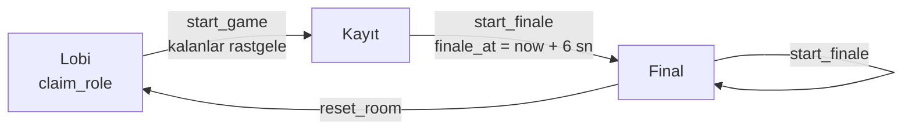

<div align="center">

# 🎙️ fam-io

### Sahneyi seç, rolünü al, sesini ver.

Arkadaşlarınla film, dizi ve çizgi film sahnelerini seslendirdiğin **çok oyunculu dublaj oyunu**.<br/>
Herkes karakterini seçer, repliklerini kaydeder, final **herkesin ekranında aynı anda** başlar ve dublajlı video indirilir.


**Ücretsiz · Filigransız · Kayıt gerektirmez**

</div>

---

<!--
Ekran görüntüleri: docs/ klasörüne koyup aşağıdaki satırların yorumunu kaldır.
<p align="center">
  
  
  
</p>
-->

## ✨ Özellikler

| | |
|---|---|
| 🎭 **Karakter seçimi** | Herkes lobide istediği karakteri seçer; seçilmeyenler başlarken rastgele dağıtılır. |
| 🎧 **Orijinali dinle** | Kayıttan önce repliğin orijinal sesini dinle, benzer bir replik uydur. |
| 🎬 **Replik bazlı kayıt** | 3-2-1 geri sayım, altyazı ve ilerleme çubuğu. Geri sayım sırasındaki sesler finale girmez. |
| ↻ **Sınırsız tekrar çekim** | Kaydını dinle, beğenmezsen tekrar çek. Kendi sesinle tüm sahneyi önizle. |
| 🍿 **Senkron final** | Final, sunucu saatine göre herkesin ekranında aynı saniyede başlar; sonunda jenerik gelir. |
| ⬇️ **Videoyu indir** | Dublajlı video tamamen tarayıcıda üretilir (MP4/WebM). Sunucu yok, ücret yok, filigran yok. |
| 🤫 **Gizli kayıtlar** | Diğer oyuncuların kayıtları veritabanı seviyesinde (RLS) final başlayana kadar görünmez. |
| ✂️ **Sahne editörü** | Klibini yükle, 1–7 karakter ekle, karakter konuşurken **K**'ya basılı tutarak replikleri işaretle. |
| 🧊 **3D dublaj makinesi** | Ana sayfada döndürülebilir, tıklanabilir 3D sahne (Lobi → Kayıt → Miks → Prömiyer → İndir). |
| 🔒 **Arkadaş kapısı** | İsteğe bağlı site şifresiyle sadece tanıdıklara açık. |

## 🕹️ Nasıl oynanır?

```
 1. Oda kur        →  Kütüphaneden sahne seç, 5 haneli kodu arkadaşlarına at
 2. Karakter seç    →  Lobide herkes istediği karakteri alır
 3. Kaydet          →  Orijinali dinle (O), kaydet (R), beğenmezsen tekrar çek, "Hazırım" de
 4. Final           →  Oda sahibi başlatır, herkes aynı anda ilk kez izler
 5. İndir           →  Dublajlı videoyu MP4 olarak kaydet
```

## 🧠 Nasıl çalışıyor?



**Kayıt hizalama ve kırpma.** Her kayıt, MediaRecorder'ın başladığı andaki `video.currentTime` ile birlikte saklanır; böylece cihaz gecikmesi ne olursa olsun ses videoda doğru yere oturur. Oynatırken her kayıt sadece kendi replik aralığında çalınır, geri sayım sırasındaki sesler kırpılır.

**Tarayıcıda video üretimi.** Video kareleri bir canvas'a çizilir, sesler Web Audio ile miks edilir, `MediaRecorder` ikisini tek dosyaya yazar. H.264 destekleyen tarayıcılarda MP4, diğerlerinde WebM üretilir.

**Senkron final.** İstemci, `server_now()` RPC'siyle sunucu saatiyle arasındaki farkı ölçer ve `finale_at` anına göre geri sayar. Tüm ses kayıtları Web Audio API ile örnek hassasiyetinde planlanır. Video ses saatini takip eder; kayma olursa oynatma hızını ince ayarlayarak ya da atlayarak düzeltir. Bluetooth kulaklık gecikmesi de hesaba katılır.

**Sıfır render maliyeti.** Final sunucuda video olarak üretilmez, tarayıcıda canlı birleştirilir. Bu sayede proje Supabase ve Vercel'in ücretsiz katmanlarında rahatça çalışır.

**Güvenlik.** Rol dağıtma, kayıt kaydetme ve finali başlatma gibi yazma işlemleri yalnızca yetki kontrolü yapan `security definer` Postgres fonksiyonlarıyla yapılır. Kayıtlar Row Level Security ile korunur.

## 🛠️ Teknolojiler

- **Frontend:** Next.js 16 (App Router), React 19, TypeScript, Tailwind CSS 4
- **Backend:** Supabase (Postgres + RLS, Realtime, Storage, anonim kimlik doğrulama)
- **Medya:** MediaRecorder API, Web Audio API, Canvas captureStream, HTML5 Video
- **3D:** three.js (prosedürel, model dosyası yok)
- **Dağıtım:** Vercel

## 🚀 Kurulum

### 1. Supabase

1. [supabase.com](https://supabase.com) üzerinde yeni bir proje oluştur (ücretsiz plan yeterli).
2. **SQL Editor**'a `supabase/schema.sql` dosyasının tamamını yapıştır ve **Run**'a bas.
3. **Authentication → Sign In / Providers → "Allow anonymous sign-ins"** seçeneğini aç.
4. **Project Settings → API** sayfasından `Project URL` ve `anon public` anahtarını kopyala.

### 2. Yerel geliştirme

```bash
git clone https://github.com/reawendev/fam-io.git
cd fam-io
cp .env.example .env.local   # Supabase bilgilerini doldur
npm install
npm run dev
```

→ http://localhost:3000

### 3. Ortam değişkenleri

| Değişken | Açıklama |
|---|---|
| `NEXT_PUBLIC_SUPABASE_URL` | Supabase proje URL'si |
| `NEXT_PUBLIC_SUPABASE_ANON_KEY` | Supabase anon (public) anahtarı |
| `SITE_PASSWORD` | *(opsiyonel)* Tanımlanırsa site sadece şifreyi bilenlere açılır |

### 4. Vercel'e deploy (komut satırından)

Windows'ta proje klasöründe `cmd` aç:

```bat
deploy env   :: ilk sefer: giriş yapar, projeyi bağlar, .env.local'i Vercel'e yükler ve yayınlar
deploy       :: sonraki güncellemeler
deploy preview
```

`deploy.cmd` Vercel CLI yoksa kurar, giriş yapılmamışsa giriş ister, proje bağlı değilse `vercel link` çalıştırır.
macOS/Linux'ta: `npx vercel link`, sonra `npm run deploy`.

> 💡 Tarayıcılar mikrofonu yalnızca **HTTPS** üzerinde (ve localhost'ta) açar. Telefondan denemek için deploy edilmiş sürümü kullan.

### Güncelleme (mevcut kurulum)

Veritabanı değişiklikleri `supabase/migrations/` klasöründe. Eski bir kurulumu güncellerken yeni dosyaları sırayla SQL Editor'da çalıştır.
Sıfırdan kurulumda sadece `schema.sql` yeterli. Ayrıntılar: [CHANGELOG.md](CHANGELOG.md).

## 🎞️ Sahne hazırlama ipuçları

- **30 sn – 2 dk** arası, 720p MP4 klipler idealdir (dosya sınırı 50 MB).
- Orijinal konuşmalar finalde duyulmasın diye video sesi varsayılan olarak kapalıdır.
- Müzik ve efektler de duyulsun istersen klibin sesini bir vokal ayırıcıyla (ör. *Ultimate Vocal Remover*) ayır, sadece müzik/efekt kısmını editördeki **Ayrı müzik/efekt dosyası** alanına yükle.
- Replik metinlerini yazarsan kayıt sırasında altyazı olarak gösterilir.
- En iyi ses için oyunculara kulaklık önerin.
- Videoyu indirme en iyi masaüstü Chrome/Edge'de çalışır; üretim klip süresi kadar sürer, bu sırada sekmeyi açık tut.

## 📁 Proje yapısı

```
fam-io/
├── app/
│   ├── page.tsx                 # Ana sayfa: takma ad, oda kur / katıl
│   ├── sahneler/                # Sahne kütüphanesi ve editör
│   ├── oda/[code]/page.tsx      # Oda: lobi → kayıt → final
│   ├── giris/ + api/giris/      # Opsiyonel site şifresi
│   └── globals.css
├── components/
│   ├── ui.tsx                   # Ortak arayüz bileşenleri (Button, Panel, RoleTag…)
│   ├── SceneEditor.tsx          # Video yükleme, karakterler, replik işaretleme
│   ├── landing/DubbingMachine3D.tsx  # Ana sayfadaki 3D makine
│   └── room/
│       ├── useRoom.ts           # Oda durumu + Supabase Realtime
│       ├── Lobby.tsx
│       ├── Recorder.tsx         # Replik bazlı kayıt ve önizleme
│       └── Finale.tsx           # Senkron final ve jenerik
├── lib/
│   ├── player.ts                # DubPlayer: senkron oynatma + replik kırpma
│   ├── exporter.ts              # Tarayıcıda MP4/WebM üretimi
│   ├── supabase.ts              # İstemci, anonim giriş, sunucu saat farkı
│   └── types.ts
├── supabase/schema.sql          # Tablolar, RLS, RPC fonksiyonları, storage
├── supabase/migrations/         # Mevcut kurulumlar için güncellemeler
├── deploy.cmd                   # Windows'tan tek komutla Vercel deploy
└── proxy.ts                     # Şifre kapısı (Next.js 16 proxy)
```

## 🙏 Teşekkür

Ana sayfadaki 3D sahne, [Agentic Factory 3D](https://github.com/eugeneshilow/agentic-3d-templates) şablonundan fam-io'nun dublaj akışına göre uyarlanmıştır.

## ⚖️ Not

fam-io arkadaşlar arası, ticari olmayan kullanım için tasarlanmıştır. Yüklediğin içeriklerin haklarından sen sorumlusun; telif hakkıyla korunan içerikleri herkese açık şekilde yayınlama.

---

<div align="center">

**Developed by Reawen** 🎙️

</div>
